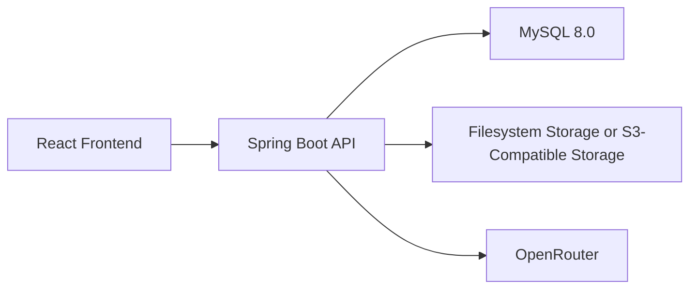

# Supabase To MySQL Migration Design

## Status

Document status: implemented architecture snapshot after the rewrite landed.

This is no longer a target-state proposal. It describes the current runtime that is now serving the application.

## Implemented Architecture



## Runtime Topology

### Frontend

- framework: `Vite + React`
- deployment form: static built assets served under `/xinyu-care/`
- runtime data access: backend HTTP only

Key integration files:

- [src/db/api.ts](/root/jerry/xinyu-care/app/src/db/api.ts:1)
- [src/lib/backend-api.ts](/root/jerry/xinyu-care/app/src/lib/backend-api.ts:1)
- [src/lib/backend-auth.ts](/root/jerry/xinyu-care/app/src/lib/backend-auth.ts:1)
- [src/contexts/AuthContext.tsx](/root/jerry/xinyu-care/app/src/contexts/AuthContext.tsx:1)

### Backend

- framework: `Spring Boot`
- runtime port: `8088` by default
- deployment form: long-running JAR managed by `systemd`
- service unit: [deploy/xinyu-care-backend.service](/root/jerry/xinyu-care/app/deploy/xinyu-care-backend.service:1)

Key backend entry points:

- auth routes: [server/src/main/java/com/xinyucare/backend/auth/AuthController.java](/root/jerry/xinyu-care/app/server/src/main/java/com/xinyucare/backend/auth/AuthController.java:1)
- AI routes: [server/src/main/java/com/xinyucare/backend/functions/FunctionController.java](/root/jerry/xinyu-care/app/server/src/main/java/com/xinyucare/backend/functions/FunctionController.java:1)
- runtime config: [server/src/main/resources/application.yml](/root/jerry/xinyu-care/app/server/src/main/resources/application.yml:1)

### Database

- engine: `MySQL 8.0`
- schema management: Flyway
- baseline schema: [server/src/main/resources/db/migration/V1__init.sql](/root/jerry/xinyu-care/app/server/src/main/resources/db/migration/V1__init.sql:1)
- baseline healing seed: [server/src/main/resources/db/migration/V2__seed_healing_content_samples.sql](/root/jerry/xinyu-care/app/server/src/main/resources/db/migration/V2__seed_healing_content_samples.sql:1)

### Storage

- development mode: filesystem storage rooted under `../storage-data`
- production mode: S3-compatible storage, with Tencent COS as the chosen production direction
- backend public URL strategy is configured in `app.storage.public-base-url`

### AI Provider

- provider: OpenRouter
- backend owns all outbound AI requests
- configured models and API key live in Spring Boot env-backed configuration

## Design Principles Actually Used

1. keep the routed frontend intact and move data/auth changes behind existing service facades
2. move the trust boundary to the backend
3. preserve payload shapes where that reduces frontend churn
4. replace database-side workflow coupling with service logic where practical
5. validate real user flows in a browser before calling the migration done

## Repository Layout

```text
app/
  src/                                   frontend
  server/                                Spring Boot backend
  deploy/                                deployment units
  scripts/                               active setup/smoke/regression scripts
  specs/supabase-to-mysql-migration/     migration record and archived regression docs
```

## Boundary Changes From The Supabase Era

### Removed from the runtime path

- Supabase Auth as the session authority
- browser-direct `supabase.from(...)` reads and writes
- Supabase Storage upload/download ownership
- Supabase Edge Functions as the live AI backend

### Retained only as historical reference

- `supabase/migrations`
- `supabase/functions`
- migration-oriented scripts or packages that still help with traceability

## Identity Model

The implemented model separates account and profile concerns:

### `users`

- primary identity record
- username, email, password hash, role, status, metadata
- last login and timestamp audit fields

### `profiles`

- one-to-one with `users`
- user-facing profile fields such as avatar, background, contact data, personal info

This mirrors the old Supabase split while making the ownership explicit in MySQL.

## Domain Tables

The active MySQL schema covers the current product domains:

- `emotion_diaries`
- `assessments`
- `wearable_data`
- `healing_contents`
- `user_healing_records`
- `community_posts`
- `community_comments`
- `post_likes`
- `meditation_sessions`
- `user_favorites`
- `doctor_patients`
- `risk_alerts`
- `knowledge_base`
- `doctor_verification_codes`
- `post_categories`

## Type Mapping

| Prior pattern | Implemented MySQL pattern |
| --- | --- |
| `UUID` | `CHAR(36)` |
| `TIMESTAMPTZ` | `DATETIME(3)` in UTC |
| `JSONB` / arrays | `JSON` |
| enum-like fields | MySQL `ENUM` or constrained strings |

## Backend API Design

The frontend now talks to the backend through a small set of stable route families:

- `/api/auth/*`
- `/api/data/*`
- `/api/storage/*`
- `/api/functions/*`
- `/api/rpc/*`
- `/api/health`

This keeps the component tree mostly insulated from the storage and database rewrite.

## Authentication Design

- auth mechanism: backend-issued bearer token
- login shape: username/password, with doctor signup gated by verification code
- current frontend state source: backend session endpoints, not client-side Supabase session listeners

The design intent here is simple: React holds session state, but Spring Boot remains the source of truth for identity and authorization.

## Authorization Design

The current runtime enforces protected access on the backend. Verified doctor workflows prove that doctor-only reads and actions are no longer granted by frontend state alone.

Residual expectation:

- all new protected endpoints must continue following this backend-first authorization model
- future admin features should follow the same pattern rather than reintroducing client trust

## Storage Design

The implemented storage abstraction has two runtime modes:

1. filesystem mode for local development
2. S3-compatible mode for hosted deployment

Objects are stored outside MySQL. MySQL stores only metadata and references needed by the product.

Current proven storage-backed workflows:

- avatar upload
- profile background upload
- diary image persistence
- knowledge document upload/delete

## AI Service Design

The current backend owns AI routes for:

- chat completion
- multimodal analysis
- speech recognition
- RAG retrieval
- multimodal fusion

Design choice:

- keep all provider credentials server-side
- let the browser call first-party backend APIs only
- verify user-facing assessment flows from the live frontend rather than treating direct API success as sufficient

## Local And Hosted Operations Design

### Local

- database bootstrap: `npm run setup:mysql`
- backend smoke: `npm run smoke:mysql-backend`
- broader full-stack shell verification: `scripts/full_stack_check.sh`
- browser-driven regression: `scripts/cdp-smoke.mjs`

### Hosted

- backend process is packaged as a Spring Boot JAR
- `systemd` launches the backend with `.env.hosted`
- CORS allows the hosted frontend origin plus local development origins

## Regression Design

Real browser interaction is the primary regression method for backend-critical user flows. This is deliberate: the migration risk was not just API correctness, but whether the live routed app still persisted and rendered the right state.

The regression stack now has three layers:

1. browser-driven scenarios in [scripts/cdp-smoke.mjs](/root/jerry/xinyu-care/app/scripts/cdp-smoke.mjs:1)
2. backend shell smoke in [scripts/smoke_mysql_backend.sh](/root/jerry/xinyu-care/app/scripts/smoke_mysql_backend.sh:1)
3. broader endpoint and persistence verification in [scripts/full_stack_check.sh](/root/jerry/xinyu-care/app/scripts/full_stack_check.sh:1)

An archived snapshot and usage guide live under [specs/supabase-to-mysql-migration/regression-archive](/root/jerry/xinyu-care/app/specs/supabase-to-mysql-migration/regression-archive).

Important operating rule:

- CDP browser scenarios should be run serially against a clean Chrome debugging target to avoid state contamination between flows

## Verified Runtime Scope

The implemented design has been browser-verified for:

- patient auth and session flows
- assessment flow and report persistence
- record update persistence
- profile and personal info persistence
- smart-band persistence
- healing interactions, favorites, and view/like counters
- doctor dashboard, patient tabs, alert handling
- doctor verification-code creation, signup, one-time consumption, and deletion
- doctor knowledge CRUD and document upload/delete

The detailed evidence is recorded in [verification-audit.md](/root/jerry/xinyu-care/app/specs/supabase-to-mysql-migration/verification-audit.md).

## Known Residual Gaps

These are not architecture blockers, but they remain worth tracking:

1. no completed repository-level historical Supabase data import run is documented yet
2. some legacy Supabase packages and shell assets still remain in the repo for compatibility or traceability
3. some frontend routes are still intentionally frontend-only and should gain backend contracts only when product scope requires it
4. minor hosted-page cleanup remains, including legacy CDN usage in the outer shell

## Design Decision For Future Development

Future development should treat Spring Boot + MySQL as the canonical platform. New features should be added to the backend and consumed through the existing frontend API layer, rather than reviving Supabase-specific runtime patterns.
